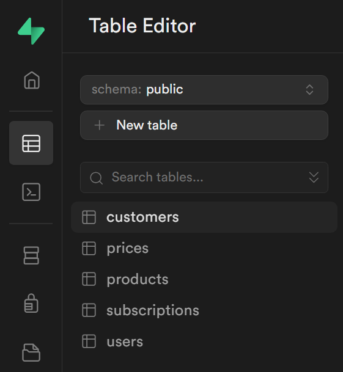
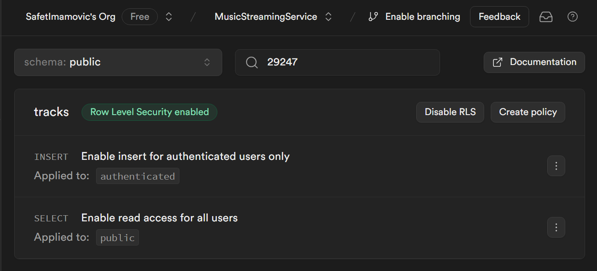
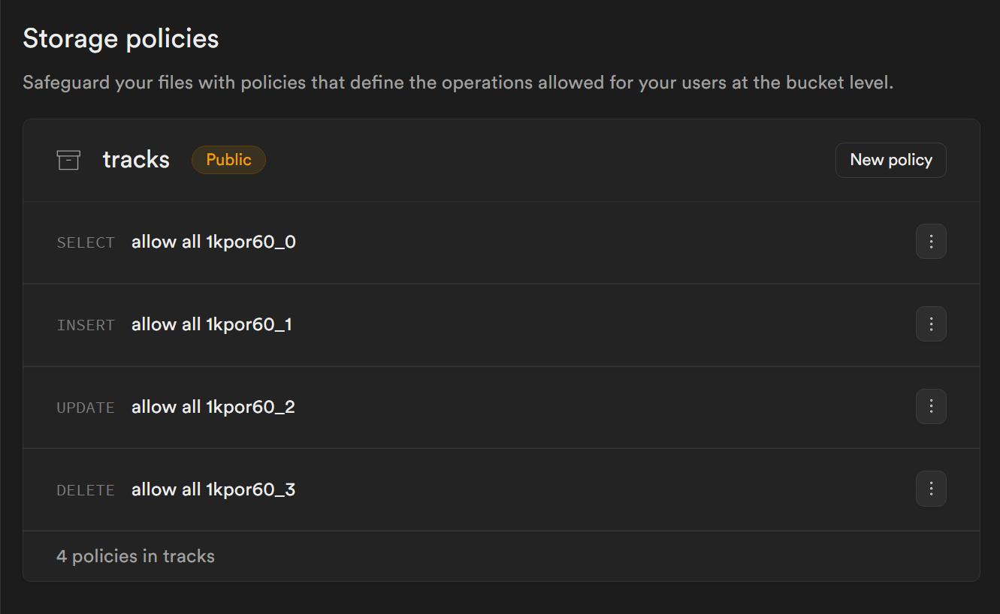
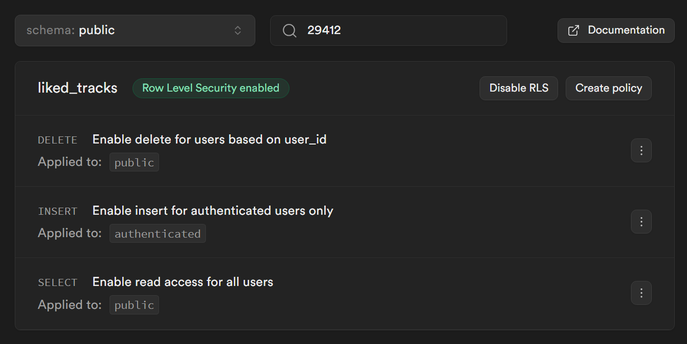

# Supabase Postavke

## Kreiranje Računa

1. **Kreiranje Supabase računa putem GitHub-a**
   - Registracija na Supabase koristeći GitHub račun.

## Postavke Projekta

1. **Postavke projekta**
   - Naziv projekta: `MusicStreamingService`
   - Region: Frankfurt, EU (lokacija servera)

2. **Lozinka projekta**
   - Generisana je lozinka za projekat i kopirana je u `password.txt` u korijenu projekta.
   - > Dodano je `password.txt` u `.gitignore` kako bi se osiguralo da se ne pošalje u repozitorij.

## API Ključevi

1. **Postavke API ključeva**
   - U postavkama Supabase -> API.
   - Prikupljeno je sljedeće:
      - `NEXT_PUBLIC_SUPABASE_URL`
      - `NEXT_PUBLIC_SUPABASE_ANON_KEY`
      - `SUPABASE_SERVICE_ROLE_KEY`
   - Dodano je ovo u `.env.local` datoteku.
   - Osigurajte da je `.env.local` dodan u `.gitignore`.

> Napomena
> **Objašnjenje API ključeva:**
> - **NEXT_PUBLIC_SUPABASE_URL**: URL vaše Supabase instance.
> - **NEXT_PUBLIC_SUPABASE_ANON_KEY**: Anonimni ključ za javni pristup.
> - **SUPABASE_SERVICE_ROLE_KEY**: Ključ sa povišenim ovlaštenjima za server-side operacije.

## Šema Baze Podataka

### Brzi Start Šabloni

1. **Stripe Pretplate Šablon**

Link za [Stripe Pretplate Šablon](https://github.com/SafetImamovic/MusicStreamingService/blob/b91003c2fdcc51e46b6174bc61f021b53e8f44a7/Dokumentacija-Writerside/dodatni-kod-primjeri/supabase-stripe-schema.sql)



> Napomena
> **Objašnjenje SQL Koda:**
> - **Users Tabela:** Čuva podatke o korisnicima sa sigurnošću na nivou reda kako bi se osiguralo da korisnici mogu pregledati i ažurirati samo svoje podatke.
> - **Trigger za nove korisnike:** Automatski kreira unos u `users` tabeli kada se novi korisnik registruje.
> - **Customers Tabela:** Povezuje ID korisnika sa Stripe ID-om korisnika, nije dostupno korisnicima.
> - **Products Tabela:** Čuva detalje o proizvodima, dostupno svima u read-only načinu.
> - **Prices Tabela:** Čuva detalje o cijenama, sinhronizovano sa Stripe-om, dostupno svima u read-only načinu.
> - **Subscriptions Tabela:** Čuva detalje o pretplatama, osiguravajući da korisnici mogu pregledati samo svoje pretplate.
> - **Realtime Pretplate:** Omogućava real-time praćenje na javnim tabelama `products` i `prices`.

### Dodatne Tabele i Politike

1. **Tracks Tabela**



```sql
create table public.tracks (
  id bigint generated by default as identity,
  created_at timestamp with time zone not null default now(),
  title text null,
  track_path text null,
  image_path text null,
  gif_path text null,
  author
  text null,
  user_id uuid null,
  constraint tracks_pkey primary key (id),
  constraint tracks_user_id_fkey foreign key (user_id) references users (id) on delete cascade
) tablespace pg_default;
```

2. **Politike za Tracks Tabelu**

```sql
alter policy "Omogući čitanje svim korisnicima" on "public"."tracks" to public using (true);
create policy "Omogući unos samo autentificiranim korisnicima" on "public"."tracks" as PERMISSIVE for INSERT to authenticated with check (true);
```

3. **Tabela Liked Tracks**

```sql
create table public.liked_tracks (
  user_id uuid not null,
  created_at timestamp with time zone not null default now(),
  track_id bigint not null,
  constraint liked_tracks_pkey primary key (user_id, track_id),
  constraint liked_tracks_track_id_fkey foreign key (track_id) references tracks (id) on delete cascade,
  constraint liked_tracks_user_id_fkey foreign key (user_id) references users (id) on delete cascade
) tablespace pg_default;
```

4. **Politike Tabele Omiljenih Pjesama**



```sql
alter policy "Dozvoli brisanje korisnicima na osnovu user_id" na "public"."liked_tracks" za javno korištenje (((SELECT auth.uid() AS uid) = user_id));
```

5. **Postavljanje Skladišta**

1. **Kreiranje Kanti**
    - **Kanta za Pjesme:** Ograničena na audio/mpeg.
    - **Kante za Slike i GIF-ove:** Nema ograničenja tipova.

2. **Politike Skladišta za Kantu za Pjesme**



```sql
CREATE POLICY "Dozvoli sve 1kpor60 0" NA storage.objects ZA SELECT ZA public KORIŠTENJEM (bucket_id = 'pjesme');
CREATE POLICY "Dozvoli sve 1kpor60 1" NA storage.objects ZA INSERT ZA public SA PROVJEROM (bucket_id = 'pjesme');
CREATE POLICY "Dozvoli sve 1kpor60 2" NA storage.objects ZA UPDATE ZA public KORIŠTENJEM (bucket_id = 'pjesme');
CREATE POLICY "Dozvoli sve 1kpor60 3" NA storage.objects ZA DELETE ZA public KORIŠTENJEM (bucket_id = 'pjesme');
```

